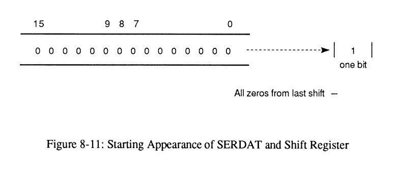
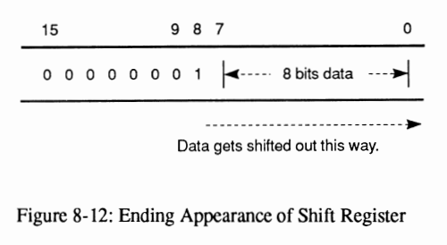

# Serial 1/0 Interface

(Taken from Amiga Hardware Reference Manual 3rd Edition)

A 25-pin connector on the back panel of the computer serves as the general purpose serial
interface. This connector can drive a wide range of different peripherals, including an external
modem or a serial printer.

For pin connections, see Appendix E.

## INTRODUCTION TO SERIAL CIRCUITRY

The Paula custom chip contains a Universal Asynchronous Receiver/Transmitter, or UART. This
UART is programmable for any rate from 110 to over 1,000,000 bits per second. It can receive or
send data with a programmable length of eight or nine bits.

The UART implementation provides a high degree of software control. The UART is capable of
detecting overrun errors, which occur when some other system sends in data faster than you
remove it from the data-receive register. There are also status bits and interrupts for the
conditions of receive buffer full and transmit buffer empty. An additional status bit is provided
that indicates "all bits have been shifted out". All of these topics are discussed below.

## SETTING THE BAUD RATE

The rate of transmission (the baud rate) is controlled by the contents of the register named
SERPER. Bits 14-0 of SERPER are the baud-rate divider bits.

All timing is done on the basis of a "color clock," which is 279.36ns long on NTSC machines
and 281.94ns on PAL machines. If the SERPER divisor is set to the number N, then N+1 color
clocks occur between samples of the state of the input pin (for receive) or between transmissions
of output bits (for transmit). Thus SERPER=(3,579,545/baud)-1. On a PAL machine,
SERPER=(3,546,895/baud)-1. For example, the proper SERPER value for 9600 baud on an
NTSC machine is (3,579,545/9600)-1=371.

With a cable of a reasonable length, the maximum reliable rate is on the order of 150,000-250,000
bits per second. Maximum rates will vary between machines. At these high rate it is not possible
to handle the overhead of interrupts. The receiving end will need to be in a tight read loop.
Through the use of low speed control information and high-speed bursts, a very inexpensive
communication network can be built.

## SETTING THE RECEIVE MODE

The number of bits that are to be received before the system tells you that the receive register is
full may be defined either as eight or nine (this allows for 8 bit transmission with parity). In
either case, the receive circuitry expects to see one start bit, eight or nine data bits, and at least
one stop bit.

Receive mode is set by bit 15 of the write-only SERPER register. Bit 15 is a 1 if you chose nine
data bits for the receive-register full signal, and a 0 if you chose eight data bits. The normal state
of this bit for most receive applications is a 0.

## CONTENTS OF THE RECEIVE DATA REGISTER

The serial input data-receive register is 16 bits wide. It contains the 8 or 9 bit input data and
status bits.
The data is received, one bit at a time, into an internal serial-to-parallel shift register. When the
proper number of bit times have elapsed, the contents of this register are transferred to the serial
data read register (SERDATR) shown in Table 8-10, and you are signaled that there is data ready
for you.
Immediately after the transfer of data takes place, the receive shift register again becomes ready to
accept new data. After receiving the receiver-full interrupt, you will have up to one full
character-receive time (8 to 10 bit times) to accept the data and clear the interrupt. If the interrupt
is not cleared in time, the OVERRUN bit is set.

Table 8-9 shows the definitions of the various bit positions within SERDATR.

### Table 8-9 SERDATR / ADKCON Registers

#### SERDATR

| Bit Number | Name    | Function |
| ---------- | ------- | -------- |
| 15         | OVRUN   | (Mirror-also appears in the interrupt request register.) Indicates that another byte of data was received before the previous byte was picked up by the processor. To prevent this condition, it is necessary to reset INTF _RBF (bit 11, receive-buffer-full) in INTREQ. |
| 14         | RBF     | READ BUFFER FULL (Mirror-also appears in the interrupt request register.) When this bit is 1, there is data ready to be picked up by the processor. After reading the contents of this dataregister, you must reset the INTF _RBF bit in INTREQ to prevent an overrun.|
| 13         | TBE     | TRANSMIT BUFFER EMPTY (Not a mirror-interrupt occurs when the buffer becomes empty.) When bit 14 is a 1, the data in the output data register (SERDA T) has been transferred to the serial output shift register, so SERDAT is ready to accept another output word. This is also true when the buffer is empty. This bit is normally used for full-duplex operation.|
| 12         | TSRE    | TRANSMIT SHIFT REGISTER EMPTY  When this bit is a 1, the output shift register has completed its task, all data has been transmitted, and the register is now idle. If you stop writing data into the output register (SERDAT), then this bit will become a 1 after both the word currently in the shift register and the word placed into SERDAT have been transmitted. This bit is normally used for half-duplex operation.|
| 11         | RXD     | Direct read of RXD pin on Paula chip.|
| 10         |         | Not used at this time.|
|  9         | STP     | Stop bit if 9 data bits are specified for receive.|
|  8         | STP     | Stop bit if 8 data bits are specified for receive.|
|  7-0       | DB7-DB0 | Low 8 data bits of received data. Data is TRUE (data you read is the same polarity as the data expected).|

#### ADKCON

| Bit Number | Name    | Function |
| ---------- | ------- | -------- |
| 15         | SET/CLR | Allows setting or clearing individual bits. If bit 15 is a 1 specified bits arc set. If bit 15 is a 0 specified bits are cleared.|
| 11         | UARTBRK | Force the transmit pin to zero.|

## HOW OUTPUT DATA IS TRANSMITTED

You send data out on the transmit lines by writing into the serial data output register (SERDAT).
This register is write-only.

Data will be sent out at the same rate as you have established for the read. Immediately after you
write the data into this register, the system will begin the transmission at the baud rate you
selected.

At the start of the operation, this data is transferred from SERDAT into an internal serial shift
register. When the transfer to the serial shift register has been completed, SERDAT can accept
new data; the TBE interrupt signals this fact.

Data will be moved out of the shift register, one bit during each time interval, starting with the
least significant bit. The shifting continues until all 1 bits have been shifted out. Any number or
combination of data and stop bits may be specified this way.

SERDAT is a 16-bit register that allows you to control the format (appearance) of the transmitted
data. To form a typical data sequence, such as one start bit, eight data bits, and one stop bit, you
write into SERDAT the contents shown in Figures 8-11 and 8-12.

The register stops shifting and signals "shift register empty" (TSRE) when there is a 1 bit
present in the bit-shifted-out position and the rest of the contents of the shift register are Os.
When new nonzero contents are loaded into this register, shifting begins again.

## SPECIFYING THE REGISTER CONTENTS

The data to be transmitted is placed in the output register (SERDAT). Above the data bits, 1 bits
must be added as stop bits. Normally, either one or two stop bits are sent.

The transmission of the start bit is independent of the contents of this register. One start bit is
automatically generated before the first data bit (bit 0) is sent.

Writing this register starts the data transmission. If this register is written with all zeros, no data
transmission is initiated.

